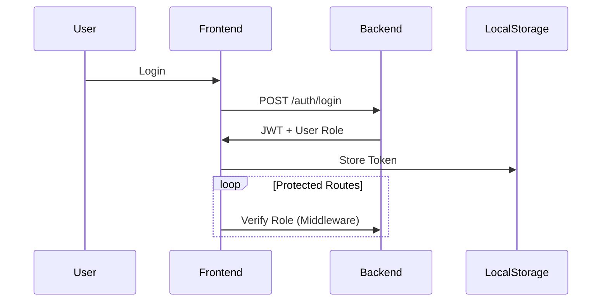

# 🔥 Vite + React Auth App with RBAC

A modern React authentication boilerplate with **Role-Based Access Control (RBAC)** built with Vite, featuring:

- ✅ JWT Authentication
- 🔐 Admin/User role permissions
- 🛡️ Protected routes
- ✨ Sleek UI with Tailwind CSS

## 🚀 Quick Start

```bash
# 1. Clone repo
git clone https://github.com/your-repo/vite-react-rbac.git
cd vite-react-rbac

# 2. Install dependencies
npm install  # or yarn/pnpm

# 3. Configure environment
cp .env.example .env

# 4. Run dev server
npm run dev
```

## ⚠️⚠️⚠️ Admin
### username: admin
### password: Qwert@1234

```
src/
├── api/
├── assets/
├── components/
├── pages/
│   ├── auth/
│   │   ├── login.tsx
│   │   └── register.tsx
│   ├── dashboard/
│   │   ├── profile/
│   │   │   └── index.tsx
│   │   ├── users/
│   │   │   ├── modals/
│   │   │   │   ├── create.tsx
│   │   │   │   ├── delete.tsx
│   │   │   │   └── update.tsx
│   │   │   ├── index.tsx
│   │   │   ├── layout.tsx
├── error/
├── store/
├── utils/
│   ├── api.js
│   ├── roles.js
├── App.tsx
├── index.css
├── main.tsx
```

## 🔐 Authentication Flow



## 👨‍💻 User Management (RBAC)

| Feature          | Admin | User(teacher, strudent) |
| ---------------- | ----- | ---- |
| View Users       | ✅     | ❌    |
| Create Users     | ✅     | ❌    |
| Edit Users       | ✅     | ❌    |
| Delete Users     | ✅     | ❌    |
| View Own Profile | ✅     | ✅    |

## 🛡️ Route Protection Example

```jsx
// routes/ProtectedRoute.jsx
const ProtectedRoute = ({ roles, children }) => {
  const { user } = useAuth();
  
  if (!user?.roles?.some(role => roles.includes(role))) {
    return <Navigate to="/unauthorized" />;
  }

  return children;
};

// Usage:
<ProtectedRoute roles={['admin']}>
  <AdminDashboard />
</ProtectedRoute>
```

## 🌟 Features

- ⚡ Blazing fast Vite build
- 🎨 Tailwind CSS styling
- 🔄 React Query for API calls
- 📱 Fully responsive
- 🧪 Jest + Testing Library

## 📦 Deployment

**Deploy with Vercel**

```bash
# Production build
npm run build

# Preview build
npm run preview
```

## 📜 License

MIT © Mugisha Jedidiah Eddy 2024

### Environment Variables

```ini
VITE_API_URL=https://ugliest-basia-eddy250-75e7e7b3.koyeb.app
```
